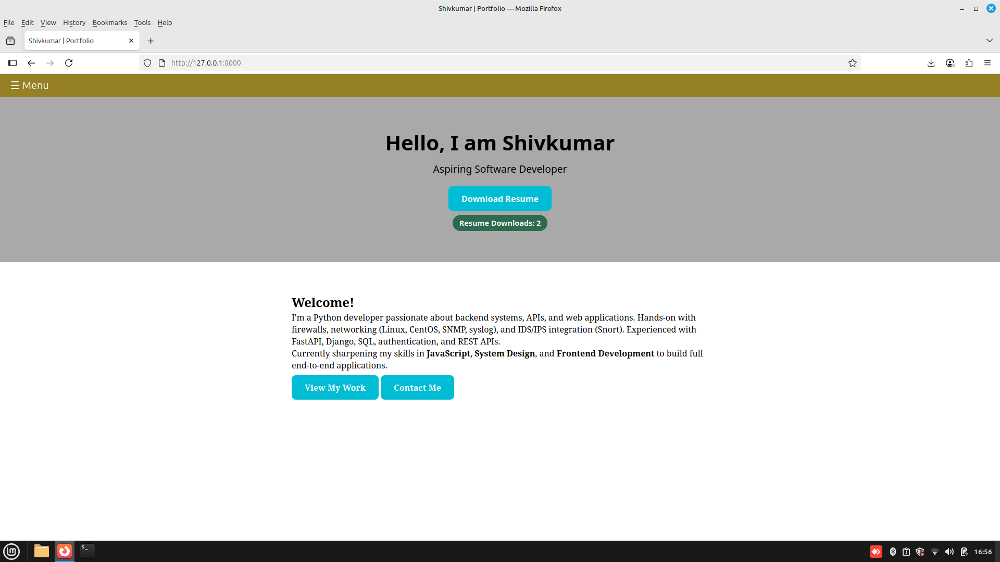
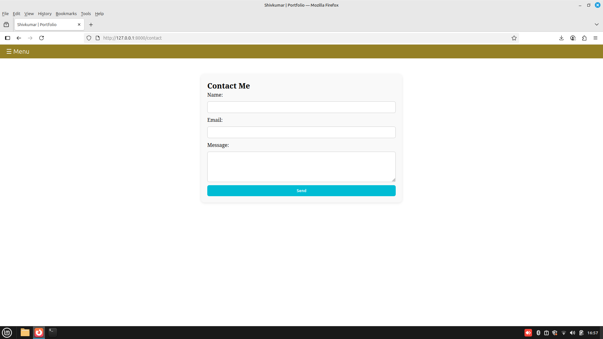

# Shivkumar's Portfolio

A personal portfolio website built with **FastAPI, Jinja2, PostgreSQL, and modern CSS**.  
It showcases my **skills, projects, and experience** in a clean and interactive way.  

---

## 🔥 Features
- 📂 **Projects Page** – dynamically rendered cards with tech stack badges.
- 💡 **Skills Page** – categorized skills with interactive hover effects.
- 💼 **Experience Page** – stored in PostgreSQL, fetched via SQLAlchemy.
- 📄 **Resume Download Counter** – tracks how many times my resume was downloaded.
- ✉️ **Contact Form** – sends emails via Gmail (FastAPI-Mail, with background tasks).
- 🎨 **Responsive Design** – works across devices with smooth hover and animations.

---

## 🛠 Tech Stack
- **Backend:** FastAPI, SQLAlchemy, PostgreSQL
- **Frontend:** Jinja2 Templates, HTML5, CSS3, JavaScript
- **Email Service:** FastAPI-Mail (Gmail SMTP with App Password)
- **Deployment Ready:** uvicorn with ASGI

---

## ⚡ Getting Started

### 1. Clone the repo
```bash
git clone https://github.com/shiv2321/shiv-portfolio.git
cd shiv-portfolio
```
### 2. Create a virtual environment
```bash
python3 -m venv venv
source venv/bin/activate
```

### 3. Install dependencies
```bash
pip install -r requirements.txt
```
### 4. Setup Environment Variables
```bash
Create a .env file in the project root:
DATABASE_URL=postgresql://<user>:<password>@localhost:5432/portfolio
MAIL_USERNAME=your_email@gmail.com
MAIL_PASSWORD=your_app_password
MAIL_FROM=your_email@gmail.com
MAIL_SERVER=smtp.gmail.com
MAIL_PORT=587
MAIL_STARTTLS=True
MAIL_SSL_TLS=False
```
### 5. Run migrations & seed data
# Create tables
```bash
python -m app.db.init_db
```
# Seed initial experience
```bash
python -m app.scripts.seed_exp
```
### 6. Start the server
```bash
uvicorn app.main:app --reload
```
Open 👉 http://127.0.0.1:8000

## 📸 Screenshots

### 🏠 Home


### ✉️ Contact
